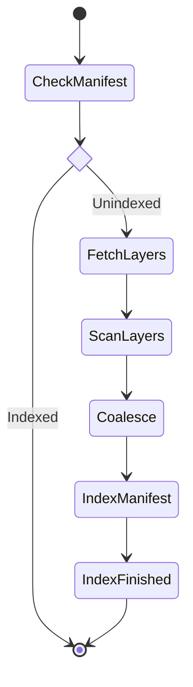
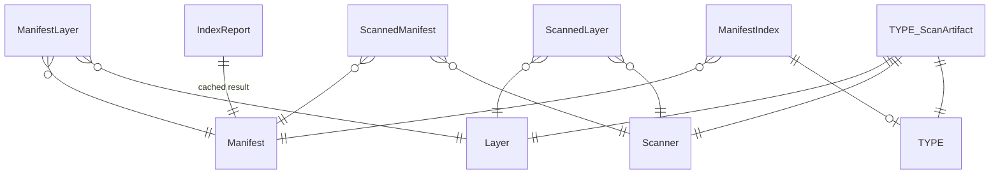

# Indexer
`claircore/indexer`

The Indexer package performs Libindex's heavy lifting. It is responsible for retreiving Manifest layers, parsing the contents of each layer, and computing an IndexReport.

To perform this action in incremental steps the Indexer is implemented as a finite state machine. At each state transition the Indexer persists an updated IndexReport to its datastore.

## States
The following diagram expresses the possible states of the Indexer:

## Data Model
The Indexer data model focuses on content addressable hashes as primary keys, the deduplication of package/distribution/repostitory information, and the recording of scan artifacts.
Scan artifacts are unique artifacts found within a layer which point to a deduplicated general package/distribution/repository record.

The following diagram outlines the current Indexer data model.

Note that `TYPE` stands in for each of the Indexer types (i.e. `Package`, `Repository`, etc.).

## HTTP Resources

Indexers as currently built may make network requests.
This is an outstanding issue.
The following are the URLs used.

{{# injecturls indexer }}
