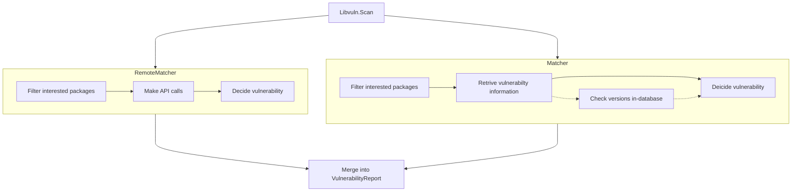

# Matcher Architecture
`claircore/internal/matcher`
`claircore/libvuln/driver`

The Matcher architecture is based on a data flow application.

When Libvuln's Scan method is called with an IndexReport it will begin the process of matching container contents with vulnerabilities.

Each configured Matcher will be instantiated concurrently. Depending on the interfaces the Matcher implements, one of the possible data flows will occur in the diagram above.

The provided IndexReport will be unpacked into a stream of IndexRecord structs. Each Matcher will evaluate each record in the stream and determine if the IndexRecord is vulnerable to a security advisory in their responsible databases.

Once each Matcher returns the set of vulnerabities, Libvuln will merge the results into a VulnerabilityReport and return this to the client.

## HTTP Resources

***NOTE***: Remote matchers are being considered for removal.

"Remote matchers" may make HTTP requests during the matcher flow.
These requests are time-bound and errors are not reported.
The following are the URLs used.

{{# injecturls matcher }}
