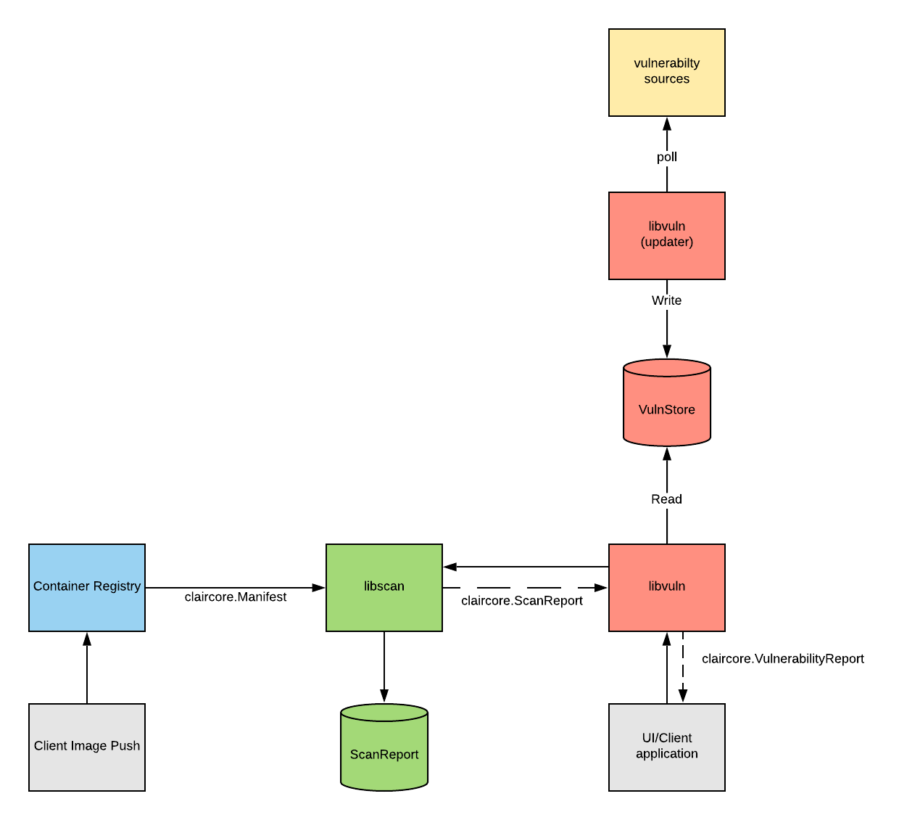

# High Level Architecture
ClairCore consists of two libraries which cooperate together.  
Allows asymmetrically scaling registry upload requests and client vulnerability scan requests.  
Each library maintains their own database.  
Architecture can be determined by SRE/Operations; libs may be ran in the same process or distributed over a network.  
Libraries can be tested independently making development easier.  

# Diagram

