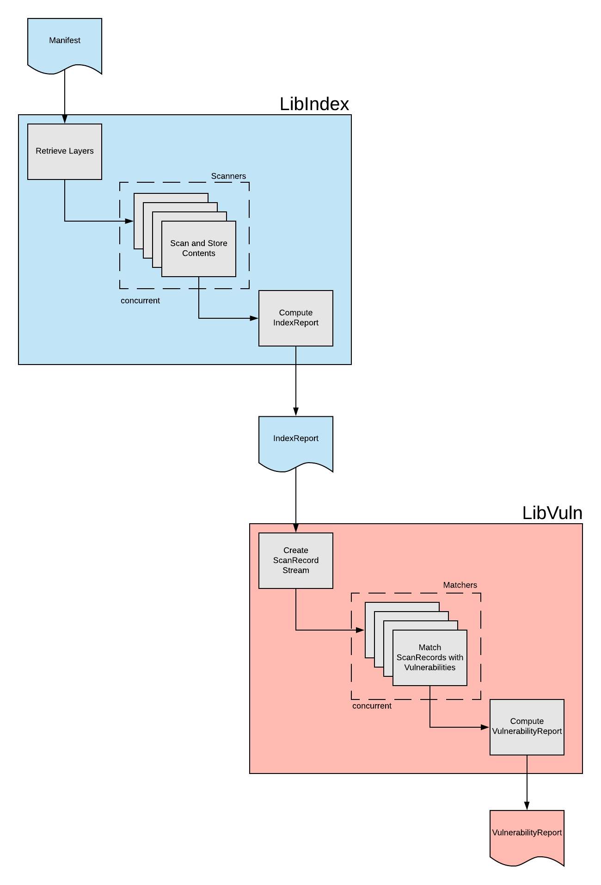

# High Level Architecture
ClairCore is designed to be embedded into another application or service wrapper.  
Two separate packages implement ClairCore's functionality: `libindex` and `libvuln`.  
The main goal of these libraries to to receive a `Manifest` and compute a `VulnerabilityReport`.  
The intermediate structure `IndexReport` is used to express all discovered artifacts within an `Manifest`.  

The follow diagram depcits the high level architecture.  
  

`libindex` is primarly implemented by the  [Indexer](./indexer_architecture.md)  
`libvuln` is primarly implemented by the  [Matcher](./matcher_architecture.md)  
