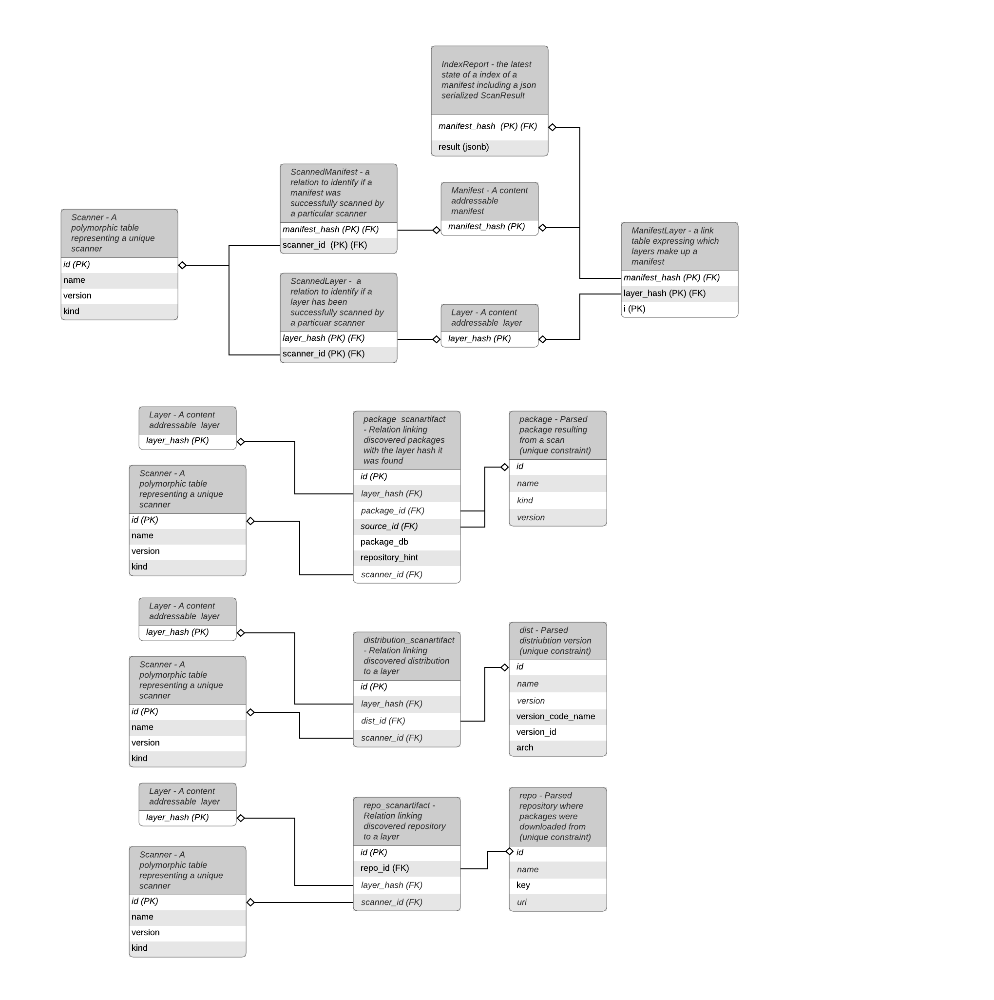

# Indexer
`claircore.internal.indexer`  

The `Indexer` package is responsible for retreiving `Manifest` layers, parsing the contents of each layer, and computing an `IndexReport`.  
The `Indexer` is implemented as an FSM to correctly report it's current state to the client.  

## States
The following diagram expresses the possible states of the Indexer  
  

## Data Model
The `Indexer` data model focuses on content addressable hashes as primary keys, the deduplication of package/distribution/repostitory information, and the recording of scan artifacts.  
Scan artifacts are unique artifacts found within a layer which point to a deduplicated general package/distribution/repository record.  

The following diagram outlines the current `Indexer` data model.  
  

