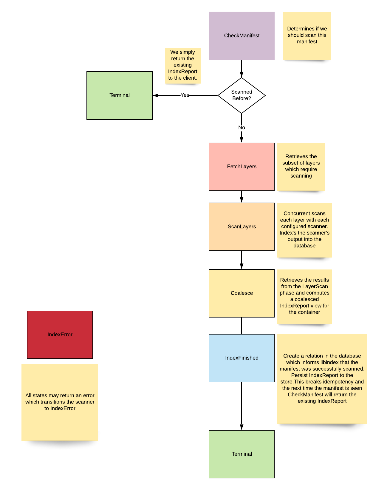

# Indexer States
The `internal/indexer/controller` package implements a state machine for indexing a manifest.  
Each layer is individually scanned and the discovered artifacts are indexed into the database.  
A `Coalescer` is then used to create platform specific coalesced image views from their discrete layers.  
A IndexReport is populated with all packages found in the **final** container image expressed by the manifest.  

# Indexer Controller States

