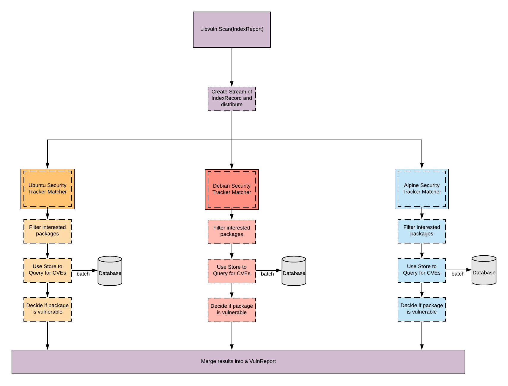

# Matcher Architecture
`claircore.internal.matcher`  
`claircore.libvuln.driver`  

The `Matcher` architecture is based on a data flow application.  
The `Matcher` functionality is implemented via a Controller in the `matcher` package and interface definitions within the `libvuln.driver` package.  
When `libvuln` is provided a `IndexReport` the `Matcher` package will transform the `IndexReport` into a stream of `IndexRecord` structs.  
The `Matcher` package then instantiates each implemented `driver.Matcher` interface and utilizes these implementations to determine if particular `IndexRecord` structs are vulnerable.  

