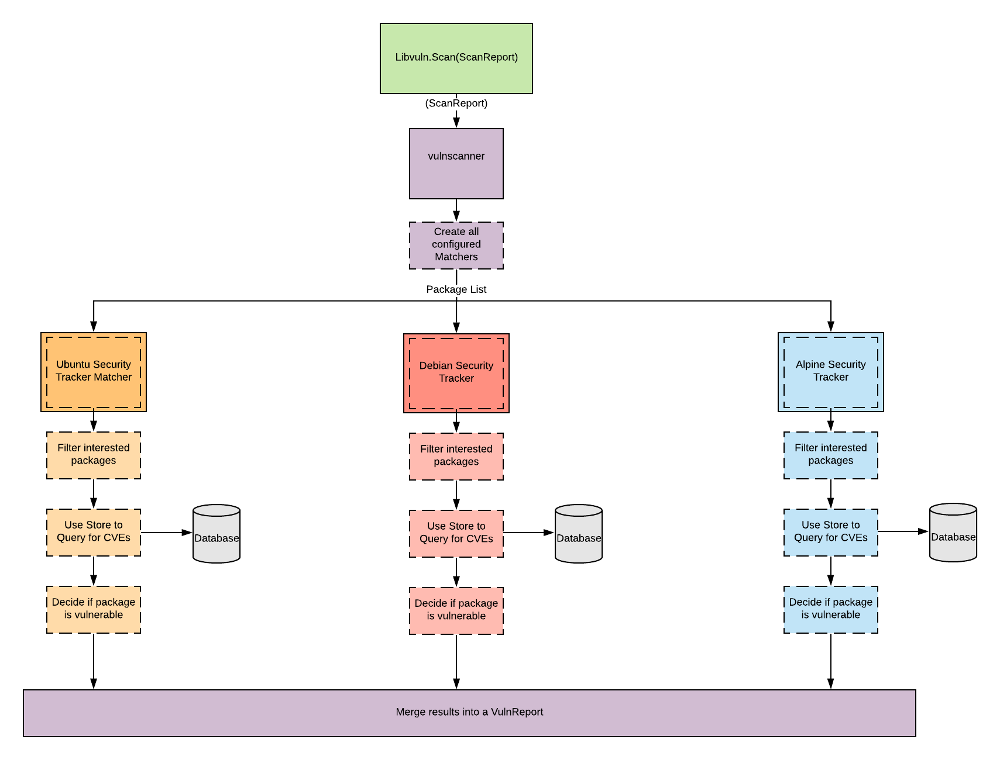

# Matching Arch
Matching packages to vulnerabilities is modeled after a dataflow application.  
Concurrent `Matcher` interfaces are launched and work on streams of packages.  
`Matchers` filter out packages they are interested and determine if this smaller subset of work are affected by the queried vulnerbilities.  
Each `Matcher` makes a single batch request to the database keeping db load to a minimum.  

# Diagram

