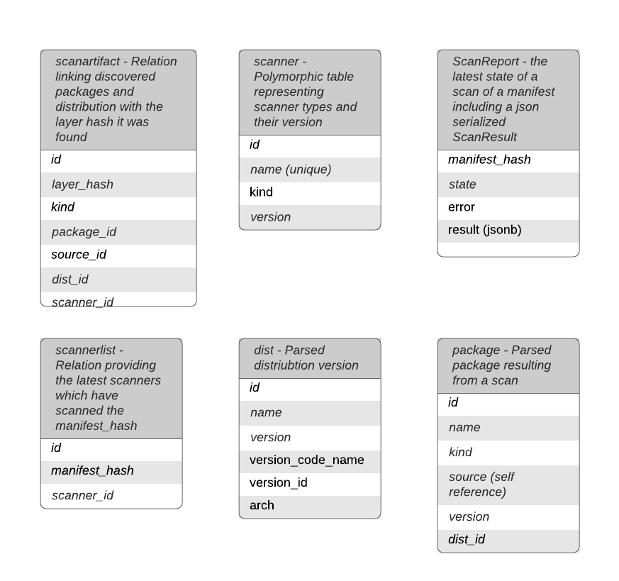

# Scanner Data Model
Libscan utilizes a scanner package with a simple datamodel
Data model focuses on image and layer hashes being content addressable allowing us to treat them as unique entities
Data model does not focus on storing layer and image information with the assumption that this data will go stale and that your container registry is the true owner of that data
Libscan is a microservice for scanning containers and extracting packages and the data model is the bare minimum to support this use case

# Model Diagram

